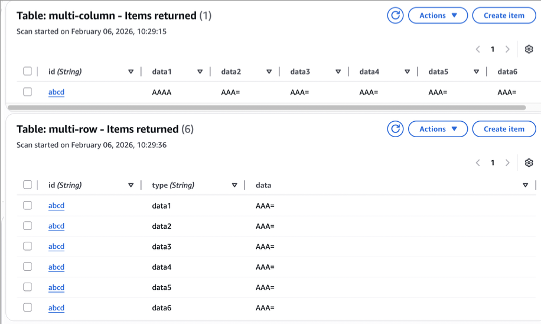

# DDB 读写模式注意点

根据官方文档所述 https://docs.aws.amazon.com/zh_cn/amazondynamodb/latest/developerguide/read-write-operations.html 在Item读写的时候，需要考虑以下细节点：

## UpdateItem 单列更新的情况

* UpdateItem 的消耗WCU是按整个item大小来计算的：修改表中的单个项目 DynamoDB 将考虑项目在更新前后显示的大小。即使您更新项目属性的子集，UpdateItem 仍会消耗全部的预置吞吐量。
* 如果更新都是整行更新，或更新比较少的情况，不需要额外考虑。
* 如果有频繁单列更新的情况下，需要考虑是否把多列拆分为多行的模式。

## 多行模式下，读取优化建议

* BatchGetItem 批量GetItem是每个Item单独计算RCU：DynamoDB 将批处理中的每个项目作为单独的 GetItem 请求。
* Query 请求是按返回的总量计算RCU的：返回的所有项目将视为一个读取操作，DynamoDB 会计算所有项目的总大小。然后，DynamoDB 将结果向上取整到下一个 4 KB 界限值。
* 因此在多行模式下，使用Query取回相关条目，会有成本上的节省

## 多列模式 & 多行模式



多列代码：

```bash
aws dynamodb create-table --table-name multi-column \
  --attribute-definitions AttributeName=id,AttributeType=S \
  --key-schema AttributeName=id,KeyType=HASH --billing-mode PAY_PER_REQUEST
# 更新全行
aws dynamodb put-item --table-name multi-column --item '{"id":{"S":"abcd"},"data1":{"B":"AAA="},"data2":{"B":"AAA="},"data3":{"B":"AAA="},"data4":{"B":"AAA="},"data5":{"B":"AAA="},"data6":{"B":"AAA="}}'
# 更新单列
aws dynamodb update-item --table-name multi-column --key '{"id":{"S":"abcd"}}' \
    --update-expression "SET data1 = :data" \
    --expression-attribute-values '{":data":{"B":"AAAA"}}'
# 获取单列
aws dynamodb get-item --table-name multi-column --key '{"id":{"S":"abcd"}}' --projection-expression "data1"
# 获取全部内容
aws dynamodb get-item --table-name multi-column --key '{"id":{"S":"abcd"}}'
```

多行代码：

```bash
aws dynamodb create-table --table-name multi-row \
  --attribute-definitions AttributeName=id,AttributeType=S \
    AttributeName=type,AttributeType=S \
  --key-schema AttributeName=id,KeyType=HASH \
    AttributeName=type,KeyType=RANGE \
  --billing-mode PAY_PER_REQUEST
# 更新单列
aws dynamodb put-item --table-name multi-row --item '{"id":{"S":"abcd"},"type":{"S":"data1"},"data":{"B":"AAA="}}'
aws dynamodb put-item --table-name multi-row --item '{"id":{"S":"abcd"},"type":{"S":"data2"},"data":{"B":"AAA="}}'
aws dynamodb put-item --table-name multi-row --item '{"id":{"S":"abcd"},"type":{"S":"data3"},"data":{"B":"AAA="}}'
aws dynamodb put-item --table-name multi-row --item '{"id":{"S":"abcd"},"type":{"S":"data4"},"data":{"B":"AAA="}}'
aws dynamodb put-item --table-name multi-row --item '{"id":{"S":"abcd"},"type":{"S":"data5"},"data":{"B":"AAA="}}'
aws dynamodb put-item --table-name multi-row --item '{"id":{"S":"abcd"},"type":{"S":"data6"},"data":{"B":"AAA="}}'
# 获取单列
aws dynamodb get-item --table-name multi-row --key '{"id":{"S":"abcd"},"type":{"S":"data6"}}'
# 获取全部内容
aws dynamodb query --table-name multi-row --key-condition-expression "id=:id" --expression-attribute-values '{":id":{"S":"abcd"}}'
```
