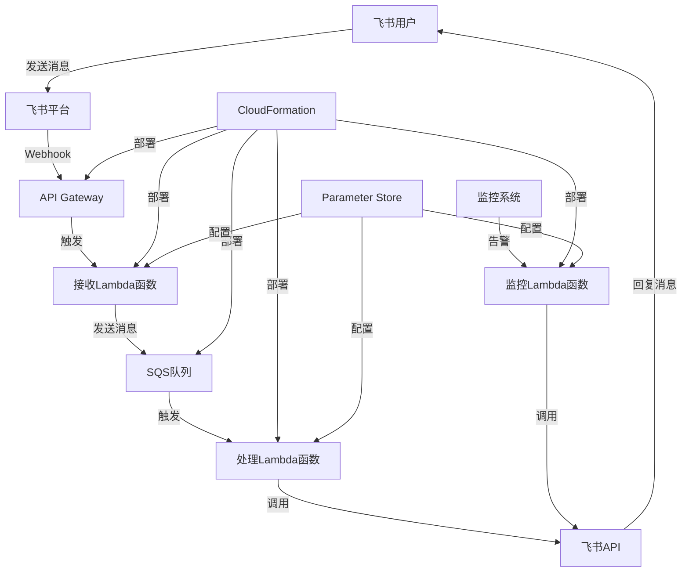

# 设计文档

## 概述

飞书机器人系统采用事件驱动的无服务器架构，通过AWS云服务实现高可用、可扩展的消息处理能力。系统主要包括消息接收、异步处理、监控推送三个核心功能模块，使用Python语言和飞书官方SDK进行开发。

## 架构

### 系统架构图



### 核心组件

1. **API Gateway**: 接收飞书webhook请求的入口点
2. **接收Lambda函数**: 验证和预处理飞书消息
3. **SQS队列**: 消息缓冲和异步处理
4. **处理Lambda函数**: 执行业务逻辑和回复消息
5. **监控Lambda函数**: 处理监控告警推送
6. **Parameter Store**: 存储配置信息和密钥

## 组件和接口

### 1. API Gateway配置

**接口设计:**
- **路径**: `/webhook`
- **方法**: POST
- **请求头验证**: 验证飞书签名
- **超时设置**: 29秒（Lambda最大执行时间）
- **错误处理**: 返回标准HTTP状态码

**集成配置:**
```yaml
Integration:
  Type: AWS_PROXY
  IntegrationHttpMethod: POST
  Uri: !Sub 'arn:aws:apigateway:${AWS::Region}:lambda:path/2015-03-31/functions/${ReceiveLambda.Arn}/invocations'
```

### 2. 接收Lambda函数 (receive_handler.py)

**功能职责:**
- 验证飞书webhook签名
- 解析飞书消息格式
- 将消息发送到SQS队列
- 返回适当的HTTP响应

**核心接口:**
```python
def lambda_handler(event, context):
    """
    处理API Gateway传入的飞书webhook请求
    
    Args:
        event: API Gateway事件对象
        context: Lambda上下文对象
        
    Returns:
        dict: HTTP响应对象
    """
    pass

def verify_feishu_signature(headers, body):
    """
    验证飞书webhook签名
    
    Args:
        headers: HTTP请求头
        body: 请求体
        
    Returns:
        bool: 签名验证结果
    """
    pass

def send_to_sqs(message_data):
    """
    将消息发送到SQS队列
    
    Args:
        message_data: 消息数据
        
    Returns:
        bool: 发送结果
    """
    pass
```

### 3. SQS队列配置

**队列设置:**
- **可见性超时**: 300秒
- **消息保留期**: 14天
- **死信队列**: 配置重试3次后进入DLQ
- **批处理**: 支持批量处理提高效率

**消息格式:**
```json
{
    "message_id": "string",
    "user_id": "string", 
    "chat_id": "string",
    "message_type": "text|image|file",
    "content": "string",
    "timestamp": "number",
    "app_id": "string"
}
```

### 4. 处理Lambda函数 (process_handler.py)

**功能职责:**
- 从SQS接收消息
- 根据消息类型执行业务逻辑
- 调用飞书API发送回复
- 处理错误和重试

**核心接口:**
```python
def lambda_handler(event, context):
    """
    处理SQS消息
    
    Args:
        event: SQS事件对象
        context: Lambda上下文对象
    """
    pass

def process_message(message_data):
    """
    处理单条消息
    
    Args:
        message_data: 消息数据
        
    Returns:
        dict: 处理结果
    """
    pass

def send_feishu_reply(chat_id, content):
    """
    发送飞书回复消息
    
    Args:
        chat_id: 聊天ID
        content: 消息内容
        
    Returns:
        bool: 发送结果
    """
    pass
```

### 5. 监控Lambda函数 (monitor_handler.py)

**功能职责:**
- 接收监控告警
- 格式化告警消息
- 推送到指定飞书群组

**核心接口:**
```python
def lambda_handler(event, context):
    """
    处理监控告警事件
    
    Args:
        event: 监控事件对象
        context: Lambda上下文对象
    """
    pass

def format_alert_message(alert_data):
    """
    格式化告警消息
    
    Args:
        alert_data: 告警数据
        
    Returns:
        dict: 格式化后的消息
    """
    pass
```

## 数据模型

### 1. 飞书消息模型

```python
from dataclasses import dataclass
from typing import Optional, Dict, Any

@dataclass
class FeishuMessage:
    """飞书消息数据模型"""
    message_id: str
    user_id: str
    chat_id: str
    message_type: str  # text, image, file, etc.
    content: str
    timestamp: int
    app_id: str
    mentions: Optional[list] = None
    
    def to_dict(self) -> Dict[str, Any]:
        """转换为字典格式"""
        pass
    
    @classmethod
    def from_webhook(cls, webhook_data: Dict[str, Any]) -> 'FeishuMessage':
        """从webhook数据创建消息对象"""
        pass
```

### 2. 监控告警模型

```python
@dataclass
class MonitorAlert:
    """监控告警数据模型"""
    alert_id: str
    service_name: str
    alert_type: str  # error, warning, info
    message: str
    timestamp: int
    severity: str
    metadata: Dict[str, Any]
    
    def to_feishu_card(self) -> Dict[str, Any]:
        """转换为飞书卡片消息格式"""
        pass
```

### 3. 配置模型

```python
@dataclass
class BotConfig:
    """机器人配置模型"""
    app_id: str
    app_secret: str
    verification_token: str
    encrypt_key: str
    bot_name: str
    webhook_url: str
    
    @classmethod
    def from_parameter_store(cls) -> 'BotConfig':
        """从Parameter Store加载配置"""
        pass
```

## 错误处理

### 1. 错误分类

**系统错误:**
- 飞书API调用失败
- AWS服务不可用
- 网络连接超时

**业务错误:**
- 消息格式不正确
- 用户权限不足
- 消息内容违规

**配置错误:**
- 密钥配置错误
- 参数缺失
- 权限配置不当

### 2. 错误处理策略

```python
class ErrorHandler:
    """统一错误处理器"""
    
    @staticmethod
    def handle_feishu_api_error(error):
        """处理飞书API错误"""
        pass
    
    @staticmethod
    def handle_aws_service_error(error):
        """处理AWS服务错误"""
        pass
    
    @staticmethod
    def should_retry(error):
        """判断是否应该重试"""
        pass
```

### 3. 重试机制

- **指数退避**: 1s, 2s, 4s, 8s
- **最大重试次数**: 3次
- **死信队列**: 重试失败后进入DLQ
- **告警通知**: 重试失败时发送告警

## 测试策略

### 1. 单元测试

**测试覆盖范围:**
- 消息解析和验证逻辑
- 业务处理逻辑
- 错误处理机制
- 配置加载功能

**测试工具:**
- pytest: Python测试框架
- moto: AWS服务模拟
- unittest.mock: 模拟外部依赖

### 2. 集成测试

**测试场景:**
- 端到端消息流程测试
- 飞书API集成测试
- AWS服务集成测试
- 错误恢复测试

### 3. 性能测试

**测试指标:**
- 消息处理延迟
- 并发处理能力
- 资源使用情况
- 成本效益分析

### 4. 安全测试

**测试内容:**
- 签名验证测试
- 权限控制测试
- 数据加密测试
- 注入攻击防护测试

## 部署和运维

### 1. CloudFormation模板结构

```yaml
# 主要资源组织
Resources:
  # API Gateway相关资源
  ApiGateway:
    Type: AWS::ApiGateway::RestApi
  
  # Lambda函数资源
  ReceiveLambda:
    Type: AWS::Lambda::Function
  
  ProcessLambda:
    Type: AWS::Lambda::Function
  
  MonitorLambda:
    Type: AWS::Lambda::Function
  
  # SQS队列资源
  MessageQueue:
    Type: AWS::SQS::Queue
  
  DeadLetterQueue:
    Type: AWS::SQS::Queue
  
  # IAM角色和策略
  LambdaExecutionRole:
    Type: AWS::IAM::Role
  
  # Parameter Store参数
  BotConfiguration:
    Type: AWS::SSM::Parameter
```

### 2. 监控和日志

**CloudWatch指标:**
- Lambda函数执行次数和错误率
- SQS队列深度和处理延迟
- API Gateway请求数和响应时间

**日志策略:**
- 结构化日志格式
- 敏感信息脱敏
- 日志保留期设置
- 错误日志告警

### 3. 安全配置

**IAM权限:**
- 最小权限原则
- 资源级别权限控制
- 跨服务访问控制

**网络安全:**
- API Gateway访问控制
- Lambda VPC配置（如需要）
- 安全组配置

**数据保护:**
- 传输加密（HTTPS/TLS）
- 存储加密（Parameter Store）
- 密钥轮换策略