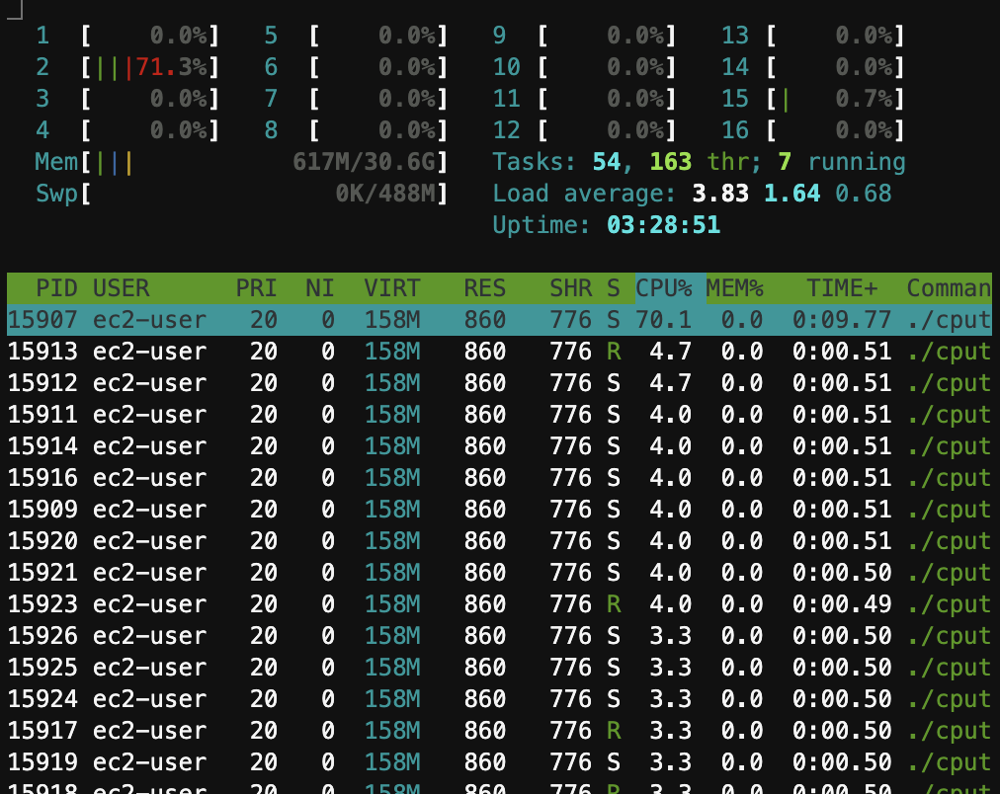

# ARM高负载性能测试

## 测试目的

在x86服务器的认识上，大部分延迟敏感的业务，因为x86使用了超线程技术来扩展并发能力，在cpu大于50%时，容易引起性能下降，因此实际工作负载场景，cpu不能打得太满，一般以控制在40%为宜。而Arm架构因为每个核都是独立核心，因此在高负载场景下，性能应该不会有太大损失，因此进行测试观察是否可以把cpu消耗增加，从而提升性价比。

## 环境准备

```bash
#gcc用于编译，htop用于观察cpu情况
yum install -y gcc htop
#下载主程序
wget https://raw.githubusercontent.com/tansoft/aws-poc/main/graviton-cpu-test/cputest.c
#编译程序，-O0 确保没有进行代码上的优化，确保代码执行的正确性
gcc -lpthread cputest.c -O0 -o cputest
```

## 测试方法

```bash
#测试单核10线程
./cputest 10

#测试双核10线程
./cputest 10 2

#使用方法1测试8核10线程
./cputest 10 8 1

#批量运行单核测试
for i in 1 2 3 4 5 10 15 20 25 30 40 50; do ./cputest $i; done | grep "mode-"

#批量运行双核方法1的测试
for i in 1 2 3 4 5 10 15 20 25 30 40 50 60 70 80 90; do ./cputest $i 2 1; done | grep "mode-"

```

测试过程可以通过htop观察，单核测试CPU会集中在CPU3上，双核测试CPU会集中在CPU3和CPU4上（注意，htop的CPU编号是从1开始）



## 测试数据

* 对比机型：c5.4x c6g.4x
* 系统版本：Amazon Linux 2
* gcc版本：

| 标识 | 机型 | 系统版本 | gcc版本 | 测试参数 |
| :----: | :----: | :---- | :---- | :---- |
| m5 | m5.xlarge | 5.10.102-99.473.amzn2.x86_64 | 7.3.1 | 双核方法1
| m6g | m6g.xlarge | 5.10.102-99.473.amzn2.aarch64 | 7.3.1 | 双核方法1

## 测试结论


## 测试原始数据

```

```
