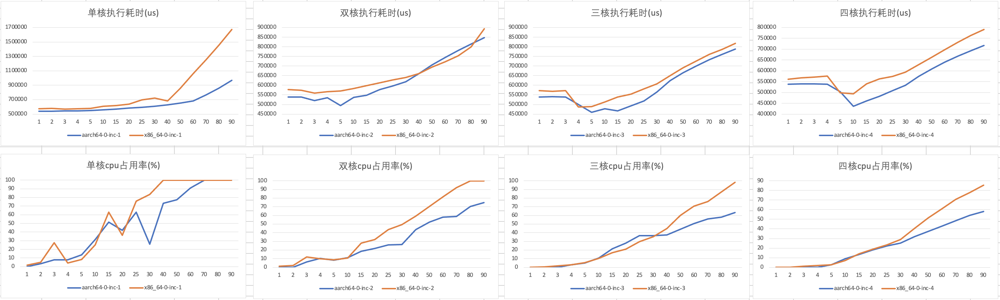

# ARM高负载性能测试

## 测试目的

在x86服务器的认识上，大部分延迟敏感的业务，因为x86使用了超线程技术来扩展并发能力，在cpu大于50%时，容易引起性能下降，因此实际工作负载场景，cpu不能打得太满，一般以控制在40%为宜。而Arm架构因为每个核都是独立核心，因此在高负载场景下，性能应该不会有太大损失，因此进行测试观察是否可以把cpu消耗增加，从而提升性价比。

## 环境准备

```bash
#gcc用于编译，htop用于观察cpu情况
yum install -y gcc htop
#下载主程序
wget https://raw.githubusercontent.com/tansoft/aws-poc/main/graviton-cpu-test/cputest.c
#编译程序，-O0 确保没有进行代码上的优化，确保代码执行的正确性
gcc -lpthread cputest.c -O0 -o cputest
```

## 测试方法

./cputest <thread_count> <use_cpu> <use_method>

* thread_count：指定测试的线程数
* use_cpu：指定这些线程一共可以使用多少个cpu，默认值为1，即只使用单个vCPU。
* use_method：默认值0。
 * 0：使用标准的测试方法，递增运算后sleep，以控制cpu利用率

```bash
#测试单核10线程
./cputest 10

#测试双核10线程
./cputest 10 2

#使用方法1测试8核10线程
./cputest 10 8 1

#批量运行双核方法测试
for i in 1 2 3 4 5 10 15 20 25 30 40 50 60 70 80 90; do ./cputest $i 2; done | grep "mode-"

```

测试过程可以通过htop观察，观察具体cpu核的使用情况，默认主线程会绑定在最后一个核，其他核按参数要求从0号cpu（htop上显示CPU1）开始顺序配置绑定对应的cpu使用。

## 测试数据

| 系列 | 机型 | 系统版本 | gcc版本 | 测试参数 |
| :----: | :----: | :---- | :---- | :---- |
| x86 | m5.xlarge | 5.10.102-99.473.amzn2.x86_64 | 7.3.1 | 1-4核分别测试方法0
| arm | m6g.xlarge | 5.10.102-99.473.amzn2.aarch64 | 7.3.1 | 1-4核分别测试方法0
| x86 | c6i.xlarge | 5.10.102-99.473.amzn2.x86_64 | 7.3.1 | 1-4核分别测试方法0
| arm | c7g.xlarge | 5.10.102-99.473.amzn2.aarch64 | 7.3.1 | 1-4核分别测试方法0

### 单核测试

* 通过单核多线程测试，能看到随着线程数增加，cpu变化是线性增加的。
* m5在40个线程时cpu打满，其他三个类型都可以到70-80线程时cpu打满。
* cpu打满后，耗时会急剧上升，m5性能要比其他三款差距较大。
* 执行耗时arm的两款实例都比x86会有10%左右优势。

### 双核测试

* x86上双核使用的是相同的物理核，而arm的双核是独立的两个物理核。
* arm的耗时有优势，仅在CPU负载比较高时（50%-70%），x86由于同物理核超线程避免cpu切换，耗时表现会稍好。

### 三核及以上测试

* 在多个物理核的情况下，arm性能会有优势。
* 在相同的cpu占用率情况下，arm能跑更多的线程。
* 由于多核会涉及到cpu物理核间的切换，x86的超线程没有优势。

注：横坐标是压测的线程数



