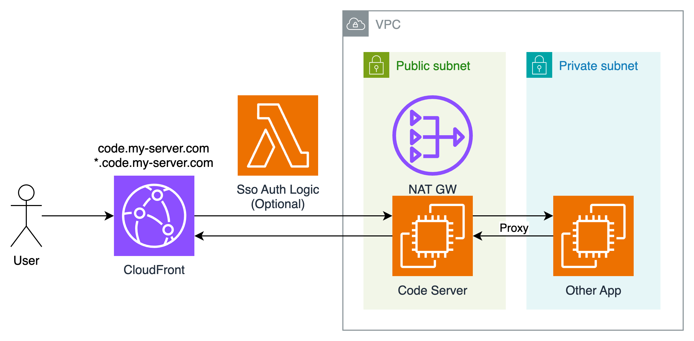

# 部署安全的开发环境

本方案可以使用 CloudFormation 模版进行一键部署：[模版下载](https://raw.githubusercontent.com/tansoft/aws-useful-code/refs/heads/main/secure-dev-env/cloudformation.yaml)

模版参数：

* AllowedIp：EC2 ssh端口的放行规则，默认0.0.0.0/32，不放开任何访问。
* CodeServerPassword：Code Server的登录密码
* DomainName：Code Server的自定义域名，通过域名访问 Code Server，例如 code.my-server.com，域名有自动代理功能，例如 8011.code.my-server.com，会访问机器的8011端口的内容，同时内容也受Code Server登录保护。
* ExistSubnetId：选择Code Server部署到的子网，虽然最佳安全实践是在私有子网，但是由于 Code Server需要使用WebSocket，而目前CloudFront vpc-origins 对于web socket支持有问题，所以这里还是使用公有子网部署。
* ExistVpcId：选择Code Server所在VPC
* HostedZoneId：如果指定了Route53上的托管域名，会自动添加域名解释，如会自动添加：code.my-server.com 和 *.code.my-server.com 的泛域名解释，HostedZone是 my-server.com 的ZoneId：Z08476XXXXXXX
* InstanceType：可以选择x86和Graviton机器
* KeyPairName：机器的ssh密钥
* LambdaEdgeVersionArn：是否配置前置的权限验证，默认为空，可以扩展实现自己的单点登录逻辑，这里指定的是 Cloudfront Lambda@edge 函数的ARN，如：arn:aws:lambda:us-east-1:123456789012:function:sso-auth-edge:1
* VolumeSize：Code Server 磁盘空间
