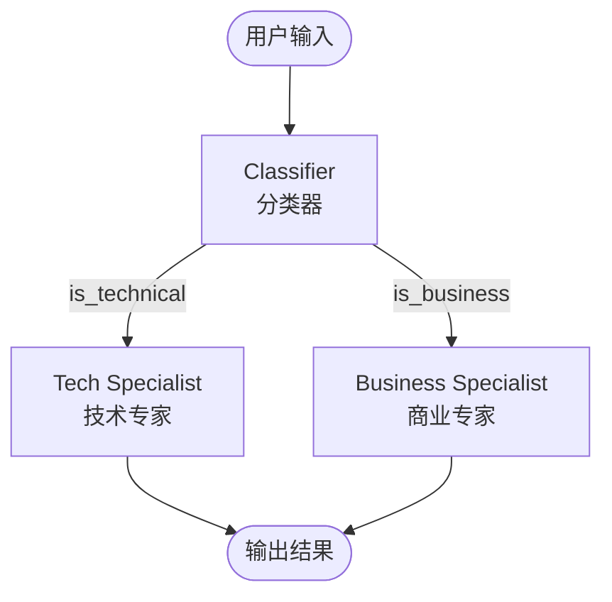
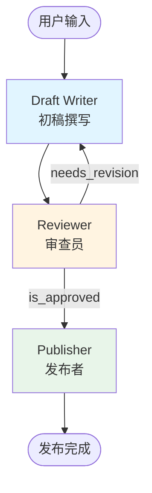
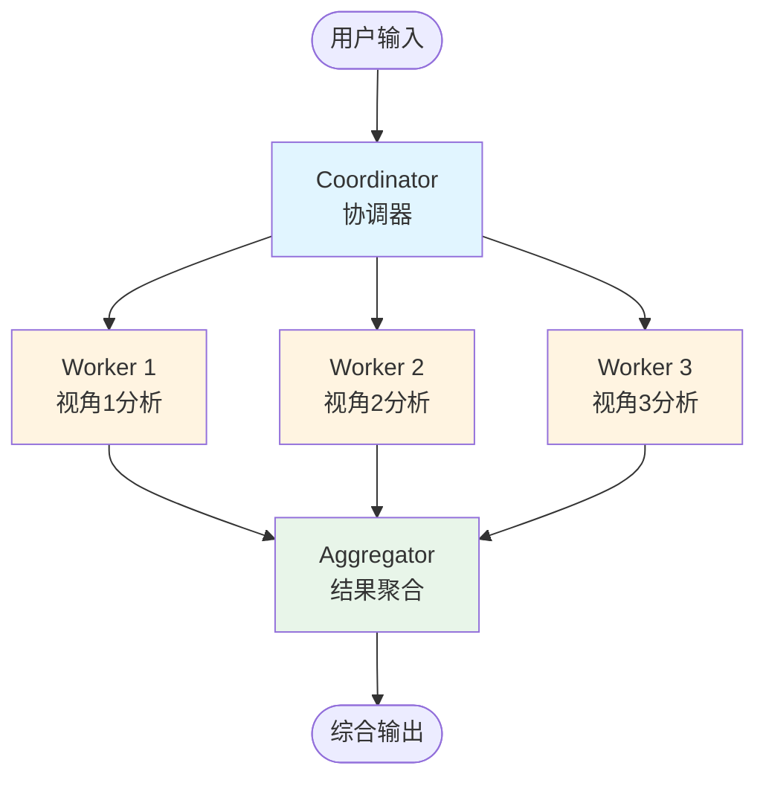

# Swarm 和 Graph 模式的几种应用场景举例

* Swarm 基本是顺序调用的逻辑，可以根据推演逻辑，选择下一个调用的agent。

* Graph 可以进行条件分支，循环执行，并发执行等多种形态。

# [demo_swarm.py](demo_swarm.py) [demo_swarm2.py](demo_swarm2.py) 

演示的是直接在agent对话中说明要用多个agent进行分析，即可自动实现，用于需要多个agent深度思考的场景。

```python
# demo_swarm.py 使用的是agent，指定swam tools的方式
agent = Agent(tools=[swarm, file_read])
agent("Use a swarm of 4 agents to analyze 'demo_data.csv' dataset and identify trends. use chinese to reply.")

# demo_swarm2.py 使用swarm调用，效果一样
agents = [agent1,agent2,agent3,agent4]
swarm = Swarm(agents)
result = swarm("AI对人类发展的影响是什么？")
```

# [demo_swarm_custom.py](demo_swarm_custom.py)

演示指定了不同角色的agent，然后会根据场景的推演，调用不同的agent完成功能。

```python
swarm = Swarm(
    [coder, researcher, reviewer, architect],
    entry_point=researcher,
    max_handoffs=20,
    max_iterations=20
)
result = swarm("设计和实现一个简单的用于 APP 的 REST API 接口")
```

# [demo_swarm_collaborative.py](demo_swarm_collaborative.py)

可以是指定agent从不同方向进行总结，最后judge汇总提炼观点再合并输出。

```python
swarm = Swarm(
    [analyst_tech, analyst_business, analyst_user, judge],
    entry_point=analyst_tech,
    max_handoffs=10
)
result = swarm("我们的电商平台应该使用微服务架构还是单体架构？")
```

# [demo_graph_conditional_routing.py](demo_graph_conditional_routing.py)

条件分支：classifier先判断用户企图，根据企图再选择下一步调用的agent

```python
builder = GraphBuilder()
builder.add_node(classifier, "classifier")
builder.add_node(tech_specialist, "tech_specialist")
builder.add_node(business_specialist, "business_specialist")

builder.add_edge("classifier", "tech_specialist", condition=is_technical)
builder.add_edge("classifier", "business_specialist", condition=is_business)
```

**流程图：**



# [demo_graph_iterative_handoff.py](demo_graph_iterative_handoff.py)

循环判断：如果初稿需要改进，则循环调用写作agent，直到符合发布要求

```python
builder = GraphBuilder()
builder.add_node(draft_writer, "draft_writer")
builder.add_node(reviewer, "reviewer")
builder.add_node(publisher, "publisher")

builder.add_edge("draft_writer", "reviewer")
builder.add_edge("reviewer", "draft_writer", condition=needs_revision)  # 循环边
builder.add_edge("reviewer", "publisher", condition=is_approved)
```

**流程图：**



# [demo_graph_parallel_processing.py](demo_graph_parallel_processing.py)

并发执行：worker并发执行，在aggregator汇总结果再输出

```python
builder = GraphBuilder()
builder.add_node(coordinator, "coordinator")
builder.add_node(worker1, "worker1")
builder.add_node(worker2, "worker2")
builder.add_node(worker3, "worker3")
builder.add_node(aggregator, "aggregator")

# 并行分发
builder.add_edge("coordinator", "worker1")
builder.add_edge("coordinator", "worker2")
builder.add_edge("coordinator", "worker3")

# 聚合结果
builder.add_edge("worker1", "aggregator")
builder.add_edge("worker2", "aggregator")
builder.add_edge("worker3", "aggregator")
```

**流程图：**

